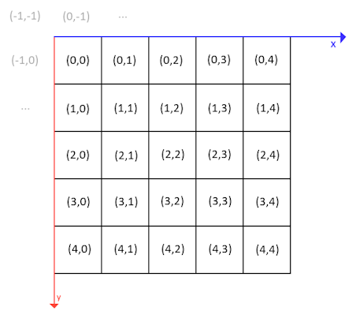
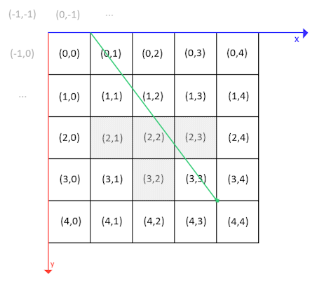

# What is this?

traversal.clj is a Clojure implementation of a popular algorithm for tracing the path of a line through a 2 or 3 dimensional grid. In it, we trace a line through a 2 dimensional grid defined by a user-submitted text file. The grid is divided up into cells which are denoted with integer coordinates, where 1 cell is represented by its coordinates in the top left, starting at (0,0), moving right in the x-positive direction, and down in the y-positive direction.



The coordinates of the grid cell are the coordinates of the top left corner of the grid, however the line can be defined in terms of floating point coordinates. So coordinates of (0.5,0.5) would be in the middle of cell (0,0).

Each cell of the grid is denoted as being passable or impassable. The algorithm traces a line, defined by the user, through all the cells of the grid that the line passes through. If the line passes through any cell which is impassable, the algorithm stops on this cell and outputs the coordinates of that cell. If all of the squares of the grid are passable, nil is output instead.

The line doesn't have to be within the limits of the grid. If it isn't, any cells that aren't defined within the grid file are treated as passable.

[Original paper describing the algorithm](http://www.cse.yorku.ca/~amana/research/grid.pdf)

# How do i use it?

traversal.clj is a command line script that takes 5 arguments. The first is the path to the text file that defines the grid you want to use. The next 2 are the floating point x and y coordinates of a 2D vector that defines the start of the line segment. The last 2 are the floating point x and y coordinates of a 2D vector that defines the end of the line segment.

An example of a grid text file:
```
00000
00000
01110
00100
00000
```

A sample run:
```
$ clj traversal.clj grid-example.txt 0 1 4 4
{:x 2, :y 2}
```

This looks for a grid defined in a file called grid-example.txt in the same directory and checks if a line starting at (0,1) and ending at (4,4) traverses through any impassable squares. In this case, such a square is found at (2,2), so the coordinates of that square are the output and the script ends. If no collision was found, the output would be `nil`.

We essentially performed this operation:

